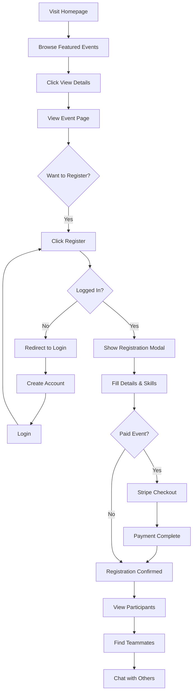
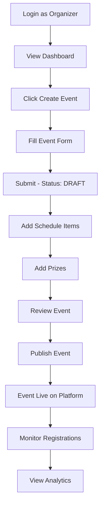
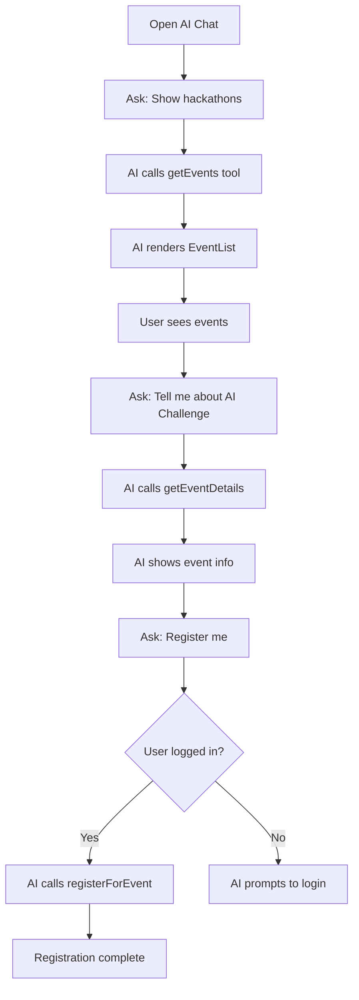

# 🎭 Vizha.AI - Complete User Stories & Tambo AI Capabilities

## 📋 Table of Contents
1. [Platform Overview](#platform-overview)
2. [User Roles](#user-roles)
3. [Attendee User Stories](#-attendee-user-stories)
4. [Organizer User Stories](#-organizer-user-stories)
5. [Tambo AI Capabilities](#-tambo-ai-capabilities)
6. [Complete User Flows](#-complete-user-flows)
7. [AI Chat Scenarios](#-ai-chat-scenarios)

---

## Platform Overview

**Vizha.AI** is an AI-powered event management platform that enables:
- **Organizers** to create and manage hackathons, conferences, workshops, and meetups
- **Attendees** to discover, register, and participate in events
- **AI Assistant (Tambo)** to provide intelligent, conversational event discovery and management

### Tech Stack
- **Frontend**: Next.js 14 (App Router), React 18, TypeScript, Tailwind CSS
- **Backend**: Next.js API Routes, Prisma ORM
- **Database**: PostgreSQL (Neon Serverless)
- **AI**: Tambo AI for Generative UI & Conversational Interface
- **Payments**: Stripe Integration
- **Auth**: JWT with HTTP-only cookies

---

## User Roles

### 👤 ATTENDEE
A user who discovers and participates in events. They can:
- Browse and search events
- Register for events (free or paid)
- Find teammates for hackathons
- Chat with other participants
- Update their profile with skills/interests

### 👔 ORGANIZER
A user who creates and manages events. They can:
- Create events (hackathons, conferences, workshops, meetups)
- Manage registrations and participants
- View analytics and statistics
- Add schedules, prizes, and event details
- Publish, edit, and cancel events

---

## 👤 Attendee User Stories

### US-A01: Account Registration
**As an Attendee**, I want to create an account so that I can register for events.

**Flow:**
1. Navigate to `/register`
2. Fill in: Name, Email, Password, Confirm Password
3. Select role: "Attendee"
4. Submit registration form
5. System creates account with bcrypt-hashed password
6. Auto-login and redirect to `/events`

**Acceptance Criteria:**
- ✅ Password must be at least 6 characters
- ✅ Email must be unique
- ✅ Passwords must match
- ✅ JWT session created and stored in HTTP-only cookie

---

### US-A02: Login to Account
**As an Attendee**, I want to log in to access my registered events and profile.

**Flow:**
1. Navigate to `/login`
2. Enter email and password
3. Submit login form
4. System validates credentials
5. Redirect to `/events` (attendee) or `/dashboard` (organizer)

**Acceptance Criteria:**
- ✅ Invalid credentials show error message
- ✅ Session expires after 7 days
- ✅ HTTP-only cookie prevents XSS attacks

---

### US-A03: Browse Events
**As an Attendee**, I want to browse all available events so I can find ones that interest me.

**Flow:**
1. Navigate to `/events`
2. View EventList component with all published events
3. See EventCalendar in sidebar showing events by date
4. View event cards showing:
   - Title, description, date, location
   - Event type badge (Hackathon/Conference/Workshop/Meetup)
   - Price (FREE or $amount)
   - Registration count/capacity

**Acceptance Criteria:**
- ✅ Only PUBLISHED events shown to public
- ✅ Events sorted by start date
- ✅ Shows registration count vs capacity

---

### US-A04: Filter Events by Type
**As an Attendee**, I want to filter events by type so I can find specific event categories.

**Flow:**
1. On `/events` page, see filter buttons
2. Click "Hackathons", "Conferences", "Workshops", or "Meetups"
3. EventList refreshes to show only that type
4. Click "All Events" to clear filter

**Filter Options:**
| Filter | Shows |
|--------|-------|
| All Events | All published events |
| Hackathons | type = HACKATHON |
| Conferences | type = CONFERENCE |
| Workshops | type = WORKSHOP |
| Meetups | type = MEETUP |

---

### US-A05: View Event Details
**As an Attendee**, I want to view complete event details before registering.

**Flow:**
1. Click "View Details" on any event card
2. Navigate to `/events/[id]`
3. View event hero section with image/gradient
4. See tabs: Overview | Schedule | Participants | Teams | Chat

**Overview Tab Shows:**
- Full description
- Date range and location
- Organizer information
- Tags and requirements
- Price and capacity
- Registration button

**Schedule Tab Shows:** (EventSchedule component)
- Timeline of sessions/activities
- Date grouping
- Time, location, and speaker for each item

**Participants Tab Shows:** (ParticipantList component)
- List of registered participants
- Filter: All | In Team | Looking for Team
- Team status badges

**Teams Tab Shows:** (TeamMatcher component - for hackathons)
- AI-powered teammate matching
- Skill selection interface
- Suggested teammates based on complementary skills

**Chat Tab Shows:** (ChatRoom component)
- Real-time chat with other participants
- Message history
- Send messages functionality

---

### US-A06: Register for Free Event
**As an Attendee**, I want to register for a free event.

**Flow:**
1. On event detail page, click "Register Now"
2. If not logged in → redirect to `/login?redirect=/events/[id]`
3. Registration modal opens with:
   - Team preference (for hackathons): Looking for team / Have team / Solo
   - Skills input (comma-separated)
   - Motivation textarea
   - Special requests (dietary, accessibility)
4. Submit registration
5. API creates Registration record with status: PENDING → CONFIRMED
6. Confirmation message shown
7. Event registration count increments

**Acceptance Criteria:**
- ✅ Cannot register if already registered
- ✅ Cannot register if event is full
- ✅ Registration stored with skills and motivation

---

### US-A07: Register for Paid Event
**As an Attendee**, I want to register for a paid event and complete payment.

**Flow:**
1. Same as US-A06 steps 1-4
2. See price displayed in modal (e.g., "$50 USD")
3. Click "Continue to Payment"
4. Redirect to Stripe Checkout session
5. Complete payment on Stripe
6. Redirect back to event page
7. Registration confirmed with payment ID

**Stripe Integration:**
- Creates Stripe Checkout Session
- Stores paymentId and paidAt on Registration
- Handles payment success/failure

---

### US-A08: Find Teammates (Hackathon)
**As an Attendee**, I want to find compatible teammates for a hackathon.

**Flow:**
1. On hackathon event page, go to "Teams" tab
2. View TeamMatcher component
3. Select your skills from predefined list:
   - JavaScript, TypeScript, Python, React, Node.js
   - Machine Learning, AI/LLM, Backend, Frontend
   - DevOps, Mobile, Design, UI/UX, etc.
4. Click "Find Teammates"
5. AI analyzes participants without teams
6. Displays suggested teammates with:
   - Name and email
   - Match score based on complementary skills
   - "Send Invite" button

**Matching Logic:**
- Finds participants marked as "Looking for team"
- Prioritizes complementary skills
- Shows top 5 matches

---

### US-A09: Chat with Participants
**As an Attendee**, I want to chat with other event participants.

**Flow:**
1. On event page, go to "Chat" tab
2. View ChatRoom component
3. See existing messages (if any)
4. Type message in input field
5. Click "Send" or press Enter
6. Message appears in chat
7. Messages auto-refresh every 5 seconds

**Chat Features:**
- Different styling for own vs others' messages
- Timestamp on each message
- Username display for others' messages
- Real-time feel with polling

---

### US-A10: Update Profile
**As an Attendee**, I want to update my profile with skills and interests.

**Flow:**
1. Navigate to `/profile`
2. View current profile information
3. Click "Edit Profile"
4. Update fields:
   - Name
   - Bio
   - Skills (comma-separated)
   - Interests (comma-separated)
5. Click "Save Changes"
6. Profile updated in database

**Profile Benefits:**
- Skills used for teammate matching
- Interests help AI recommend events
- Bio displayed to other participants

---

### US-A11: View My Registrations
**As an Attendee**, I want to see all events I've registered for.

**Flow:**
1. Navigate to `/profile` or `/dashboard`
2. View "My Registrations" section
3. See list of registered events with:
   - Event title and type
   - Registration status (Pending/Confirmed/Cancelled)
   - Event date and location
4. Click event to view details

---

### US-A12: Use AI Chat Assistant
**As an Attendee**, I want to use natural language to discover and interact with events.

**Flow:**
1. Navigate to `/chat`
2. See AI Event Assistant welcome message
3. Type natural language query (see AI Chat Scenarios)
4. AI responds with:
   - Text explanation
   - Rendered Tambo components (EventList, EventCard, etc.)
5. Interact with rendered components
6. Continue conversation for more actions

---

## 👔 Organizer User Stories

### US-O01: Organizer Registration
**As an Organizer**, I want to create an organizer account to host events.

**Flow:**
1. Navigate to `/register`
2. Fill in: Name, Email, Password
3. Select role: "Organizer"
4. Submit registration
5. Redirect to `/dashboard`

---

### US-O02: View Dashboard
**As an Organizer**, I want a dashboard to manage all my events.

**Flow:**
1. Login as organizer
2. Redirect to `/dashboard`
3. View:
   - Quick stats cards:
     - Total Events
     - Active Events (Published/Ongoing)
     - Total Registrations across all events
     - Upcoming Events
   - EventAnalytics component with charts
   - My Events table with actions

**Dashboard Features:**
- "+ Create Event" button
- View/Edit/Delete actions for each event
- Registration counts per event

---

### US-O03: Create New Event
**As an Organizer**, I want to create a new event with all details.

**Flow:**
1. Click "+ Create Event" from dashboard
2. Navigate to `/events/create`
3. Fill in event form:

| Field | Type | Required | Description |
|-------|------|----------|-------------|
| Title | text | ✅ | Event name |
| Description | textarea | ✅ | Full description |
| Type | select | ✅ | HACKATHON/CONFERENCE/WORKSHOP/MEETUP |
| Location | text | ✅ | Venue or "Virtual" |
| Start Date | datetime | ✅ | Event start |
| End Date | datetime | ✅ | Event end |
| Capacity | number | ✅ | Max attendees |
| Price | number | ❌ | 0 for free events |
| Tags | text | ❌ | Comma-separated |
| Image URL | text | ❌ | Cover image |

4. Submit form
5. Event created with status: DRAFT
6. Redirect to event page

**Acceptance Criteria:**
- ✅ Only ORGANIZER role can create events
- ✅ All required fields validated
- ✅ New event starts in DRAFT status

---

### US-O04: Publish Event
**As an Organizer**, I want to publish my event so attendees can see it.

**Flow:**
1. Create event (starts as DRAFT)
2. From dashboard, click "Edit" on event
3. Change status to "PUBLISHED"
4. Save changes
5. Event now visible on `/events` page

**Event Statuses:**
| Status | Visibility | Description |
|--------|------------|-------------|
| DRAFT | Only organizer | Work in progress |
| PUBLISHED | Public | Open for registration |
| ONGOING | Public | Event currently happening |
| COMPLETED | Public | Event finished |
| CANCELLED | Public | Event cancelled |

---

### US-O05: View Event Analytics
**As an Organizer**, I want to see analytics for my events.

**Flow:**
1. On dashboard, view EventAnalytics component
2. See metrics:
   - Total Events count
   - Total Registrations count
   - Total Revenue ($)
3. View charts:
   - Registration Trend (7d/30d/90d)
   - Events by Type (bar chart)
   - Registration by Status (Confirmed/Pending/Cancelled)

**Analytics Features:**
- Time range selector (7 days, 30 days, 90 days)
- Visual bar charts
- Percentage changes from previous period

---

### US-O06: Manage Participants
**As an Organizer**, I want to see who registered for my event.

**Flow:**
1. Go to event detail page
2. Click "Participants" tab
3. View ParticipantList component
4. See all registered users with:
   - Name and avatar
   - Registration date
   - Team status (for hackathons)
   - Registration status badge
5. Filter by: All | In Team | Looking for Team

---

### US-O07: Add Event Schedule
**As an Organizer**, I want to add a schedule to my event.

**Database Model: ScheduleItem**
```
- title: string
- description: string (optional)
- startTime: DateTime
- endTime: DateTime
- location: string (optional)
- speaker: string (optional)
- order: number
```

**Flow:**
1. Create schedule items via API
2. Items displayed in EventSchedule component
3. Grouped by date
4. Shows timeline with time, title, description, location, speaker

---

### US-O08: Add Event Prizes
**As an Organizer**, I want to add prizes to my hackathon.

**Database Model: Prize**
```
- rank: number (1, 2, 3, etc.)
- title: string ("First Place", "Best Design")
- description: string
- value: number (5000)
- currency: string ("USD")
```

**Flow:**
1. Create prize entries via API
2. Prizes displayed in PrizeDisplay component
3. Shows:
   - 🥇🥈🥉 medals for top 3
   - Prize title and description
   - Value with currency
   - Total prize pool

---

### US-O09: Use AI to Create Event
**As an Organizer**, I want to use AI to help create an event.

**Flow:**
1. Navigate to `/chat`
2. Ask: "Create a new hackathon for 200 people in March"
3. AI calls `createEvent` tool with parameters
4. Event created and displayed
5. AI provides confirmation and link

---

## 🤖 Tambo AI Capabilities

### Registered Components

Tambo can dynamically render these components based on conversation context:

| Component | Description | Use Case |
|-----------|-------------|----------|
| **EventList** | Grid of event cards with filters | "Show me upcoming hackathons" |
| **TeamMatcher** | AI teammate matching interface | "Help me find teammates" |
| **EventSchedule** | Timeline view of event agenda | "What's the schedule for this event?" |
| **PrizeDisplay** | Prize showcase with values | "What are the prizes?" |
| **ParticipantList** | Event participants grid | "Who's registered for this event?" |
| **EventCalendar** | Monthly calendar view | "Show events in calendar format" |
| **EventAnalytics** | Registration analytics dashboard | "Show me my event analytics" |
| **ChatRoom** | Real-time event chat | "Open the event chat" |

### Registered Tools

Tambo can execute these functions during conversation:

| Tool | Description | Example Trigger |
|------|-------------|-----------------|
| `getEvents` | Fetch events with filters | "Show me hackathons" |
| `getEventDetails` | Get full event info | "Tell me about [event]" |
| `registerForEvent` | Register user for event | "Register me for this" |
| `getCurrentUser` | Get logged-in user info | "What's my profile?" |
| `getMyRegistrations` | User's registered events | "What events am I registered for?" |
| `getMyEvents` | Organizer's created events | "Show my events" |
| `createEvent` | Create new event | "Create a hackathon" |
| `updateProfile` | Update user profile | "Update my skills" |

### AI System Capabilities

1. **Context Awareness**: Remembers conversation history
2. **Role Detection**: Knows if user is ORGANIZER or ATTENDEE
3. **Smart Component Selection**: Chooses appropriate component for response
4. **Tool Chaining**: Can call multiple tools to complete complex requests
5. **Streaming Responses**: Generates responses in real-time

---

## 🔄 Complete User Flows

### Flow 1: New Attendee Journey



### Flow 2: Organizer Event Creation



### Flow 3: AI-Assisted Event Discovery



---

## 💬 AI Chat Scenarios

### Scenario 1: Event Discovery

**User**: "Show me upcoming hackathons"

**Tambo AI Response**:
1. Calls `getEvents(type: 'HACKATHON')`
2. Renders `EventList` component with hackathon filter
3. Shows: "Here are the upcoming hackathons! I found [X] events you might be interested in."

---

### Scenario 2: Event Details

**User**: "Tell me more about the AI Innovation Challenge"

**Tambo AI Response**:
1. Calls `getEventDetails(eventId)`
2. Returns detailed event object with:
   - Full description
   - Schedule items
   - Prizes
   - Registration count
3. Shows: "The AI Innovation Challenge is a 48-hour hackathon..."
4. May render `EventSchedule` and `PrizeDisplay` components

---

### Scenario 3: Registration

**User**: "I want to register for this hackathon"

**Tambo AI Response**:
1. Calls `getCurrentUser()` to check login status
2. If logged in: Calls `registerForEvent(eventId, skills, motivation)`
3. Shows: "Great! I've registered you for the AI Innovation Challenge. Would you like to find teammates?"
4. If not logged in: "You need to be logged in to register. Please visit /login first."

---

### Scenario 4: Teammate Finding

**User**: "Help me find teammates for this hackathon"

**Tambo AI Response**:
1. Renders `TeamMatcher` component for the event
2. Shows: "I'll help you find compatible teammates! Select your skills below and I'll suggest people looking for team members with complementary skills."

---

### Scenario 5: My Registrations

**User**: "What events am I registered for?"

**Tambo AI Response**:
1. Calls `getMyRegistrations()`
2. Returns list of user's registrations
3. Shows: "You're registered for [X] events:"
4. Lists events with dates and status

---

### Scenario 6: Organizer - View My Events

**User** (as Organizer): "Show me my events"

**Tambo AI Response**:
1. Calls `getMyEvents()`
2. Returns organizer's created events
3. Renders `EventList` or `EventAnalytics`
4. Shows: "Here are your events. You have [X] active events with [Y] total registrations."

---

### Scenario 7: Organizer - Create Event

**User** (as Organizer): "Create a new workshop about React for 50 people next month in San Francisco"

**Tambo AI Response**:
1. Extracts parameters from natural language:
   - type: WORKSHOP
   - title: "React Workshop"
   - capacity: 50
   - location: "San Francisco"
   - dates: next month
2. Calls `createEvent(...)` with parameters
3. Shows: "I've created your React Workshop! It's currently in DRAFT status. Would you like me to add a schedule or publish it?"

---

### Scenario 8: Profile Update

**User**: "Update my skills to include Python and Machine Learning"

**Tambo AI Response**:
1. Calls `updateProfile(skills: ['Python', 'Machine Learning'])`
2. Shows: "I've updated your profile with Python and Machine Learning skills. These will help you find better teammate matches!"

---

### Scenario 9: Calendar View

**User**: "Show me events in a calendar"

**Tambo AI Response**:
1. Renders `EventCalendar` component
2. Shows: "Here's a calendar view of upcoming events. Events are color-coded by type:"
   - 🟣 Purple = Hackathons
   - 🔵 Blue = Conferences
   - 🟠 Orange = Workshops
   - 🟢 Green = Meetups

---

### Scenario 10: Analytics (Organizer)

**User** (as Organizer): "Show me analytics for my events"

**Tambo AI Response**:
1. Renders `EventAnalytics` component with organizerId
2. Shows metrics dashboard with:
   - Total events, registrations, revenue
   - Registration trends over time
   - Breakdown by event type
   - Registration status distribution

---

## 📊 Summary: What Tambo Can Do

### For Attendees:
| Action | Voice/Text Command | Tambo Capability |
|--------|-------------------|------------------|
| Find events | "Show me hackathons" | `getEvents` → `EventList` |
| View event | "Tell me about [event]" | `getEventDetails` |
| Register | "Register me for this" | `registerForEvent` |
| Find team | "Help me find teammates" | `TeamMatcher` component |
| Check registrations | "What events am I in?" | `getMyRegistrations` |
| Update profile | "Add Python to my skills" | `updateProfile` |
| View schedule | "What's the schedule?" | `EventSchedule` component |
| View prizes | "What are the prizes?" | `PrizeDisplay` component |
| Calendar view | "Show calendar" | `EventCalendar` component |

### For Organizers:
| Action | Voice/Text Command | Tambo Capability |
|--------|-------------------|------------------|
| Create event | "Create a hackathon for 100 people" | `createEvent` |
| View my events | "Show my events" | `getMyEvents` |
| View analytics | "Show analytics" | `EventAnalytics` component |
| Check registrations | "Who registered?" | `ParticipantList` component |

---

## 🎯 Key Differentiators

1. **Conversational UI**: Instead of clicking through menus, users can naturally ask for what they want
2. **Smart Component Rendering**: AI decides which component best answers the user's query
3. **Context Persistence**: Conversation history maintained across interactions
4. **Role-Aware Responses**: AI tailors responses based on ATTENDEE vs ORGANIZER role
5. **Action Execution**: AI can perform actions (register, create) not just show information
6. **Seamless Handoff**: Rendered components are fully interactive, not just static

---

*Built with ❤️ using Next.js 14 and Tambo AI*
